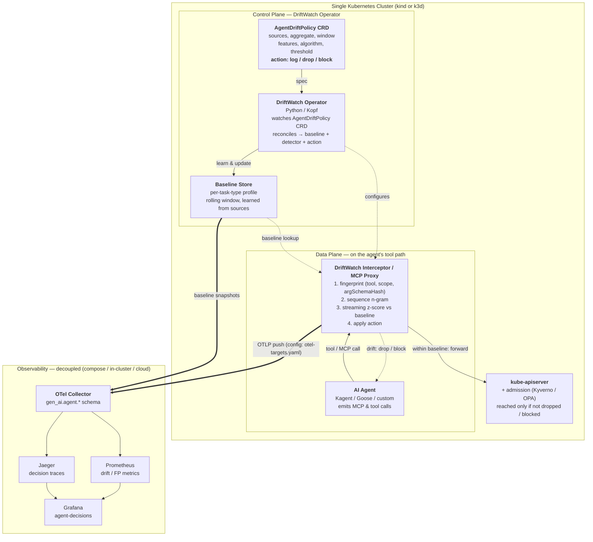

# DriftWatch

**A Kubernetes operator that governs what an AI agent *decides* — before that decision
becomes an API call.**

Admission controllers (Kyverno, OPA/Gatekeeper, agent gateways) see a well-formed API
request. They cannot see *which* agent issued it, *which* tool it picked, or *whether its
decision chain has drifted* from how that task normally runs. By the time admission looks,
the agent has already chosen. DriftWatch watches the layer underneath — the agent's
**decision plane**, its MCP and tool calls — scores each live decision *chain* against a
baseline it learns per task from real runs, and **logs / drops / blocks** drift *before it
reaches the API*. All declared in one `AgentDriftPolicy` CRD.

It is **complementary to admission control, not a replacement.** Admission still guards the
API boundary; DriftWatch guards the layer admission structurally can't see — the agent's
*choice, scope, and order*.

> Reference implementation behind the KubeCon NA 2026 talk *"DriftWatch: Catching AI Agent
> Decision Drift Before It Hits the Kubernetes API."* The full proposal and design rationale
> live in [`../CFP-A — DriftWatch (alternative).md`](../CFP-A%20—%20DriftWatch%20(alternative).md).
> Apache-2.0.

---

## Table of contents

- [The idea in one diagram](#the-idea-in-one-diagram)
- [How a single tool call is scored](#how-a-single-tool-call-is-scored)
- [The contract: `AgentDriftPolicy`](#the-contract-agentdriftpolicy)
- [Two seats on the tool path](#two-seats-on-the-tool-path-sidecar-and-mcp-proxy)
- [Components — what sits where](#components--what-sits-where)
- [Capability map (E1–E9)](#capability-map-e1e9)
- [The `gen_ai.agent.*` telemetry schema](#the-gen_aiagent-telemetry-schema)
- [Five drift scenarios](#five-drift-scenarios-the-live-demo)
- [Install](#install)
  - [1. Local / dev](#1-local--dev)
  - [2. Governance plane (chart)](#2-governance-plane-crd--operator--rbac)
  - [3. Apply a policy — shadow then enforce](#3-apply-a-policy--shadow-then-enforce)
  - [4. Govern an agent pod (sidecar / HTTP hop)](#4-govern-an-agent-pod-sidecar--http-hop)
  - [5. Govern at the MCP hop (chain-aware proxy / path B)](#5-govern-at-the-mcp-hop-chain-aware-proxy--path-b)
  - [6. With Kagent (RemoteMCPServer)](#6-with-kagent-remotemcpserver)
- [Configuration reference](#configuration-reference)
- [Status & roadmap](#status--roadmap)
- [Documentation](#documentation)

---

## The idea in one diagram

A single Kubernetes cluster. The **control plane** is the DriftWatch operator, reconciling
`AgentDriftPolicy` CRDs into running governance. The **data plane** sits on the agent's
MCP/tool path *upstream of the kube-apiserver*, so a drifting decision is caught **before** it
ever becomes an API request. Every score and decision is emitted in the `gen_ai.agent.*`
decision-quality OTel schema and fanned out to a **decoupled** observability stack (Jaeger /
Prometheus / Grafana).



> **Decoupling:** the governance plane (operator, CRD, interceptor/proxy) runs *in* the
> cluster; the observability backend is reached over OTLP at an endpoint named in
> [`config/otel-targets.yaml`](config/otel-targets.yaml). Where the dashboards live never
> changes what the cluster enforces.

---

## How a single tool call is scored

The key invariant: **the score is computed on the agent's *decision chain* — which tool,
which scope, which order, which argument shape — not on the resulting API object.** By the
time admission would see a `CREATE`, DriftWatch has already decided whether the agent
*should have asked for it*.

```
agent emits tool call
        │
        ▼
┌────────────────────────────────────────────────┐
│ DriftWatch (sidecar or MCP proxy)              │
│  1. fingerprint  (tool, scope, argSchemaHash)  │
│  2. sequence n-gram over the recent chain      │
│  3. streaming z-score  vs per-task baseline ───┼──► Baseline Store (lookup)
│  4. raw z ≥ threshold ?                        │
└───────┬─────────────────────────────┬──────────┘
        │ no  (within baseline)        │ yes (drift)
        ▼                              ▼
   forward to                   apply CRD action:
   kube-apiserver                 log  → forward + flag
   (→ admission → API)            drop → silently refuse
        │                         block→ 403 / MCP error to agent
        ▼                              │
   [action executes]                   │
        └──────────────┬───────────────┘
                       ▼
        gen_ai.agent.* span + gen_ai.evaluation.result → OTel
```

Detection is deliberately **streaming statistics, not a learned anomaly model** — it stays
explainable on stage, cheap to run in-cluster, and debuggable the moment it's wrong. Two
values travel together: the **raw z-score** (in std-devs, what `threshold` is compared
against) and a **normalized `[0,1]` score** (`1 − e^(−z/k)`) that lands on the
`gen_ai.evaluation.result` event for dashboards. Enforcement is decided on the raw z; the
`[0,1]` value is the human-friendly signal.

---

## The contract: `AgentDriftPolicy`

The whole governance contract is one declarative object — baseline sources, detection
algorithm, action, and OTel wiring. This is the manifest you `kubectl apply` (`spec` only);
the operator **writes** `status`.

```yaml
apiVersion: driftwatch.graphsentinel.org/v1alpha1
kind: AgentDriftPolicy
metadata:
  name: kagent-cluster-ops
spec:
  selector:
    matchLabels: { app: kagent }          # which agent workloads this governs

  runtimes:                                # runtimes are config, not code (FR-8)
    - name: kagent
      adapter: builtin/kagent              # ships with DriftWatch
    - name: goose
      adapter: builtin/goose
    - name: my-langgraph-agent
      adapter: custom                      # user-supplied adapter
      interceptor: { port: 8080, protocol: mcp }   # mcp | openai-tools | http

  baseline:
    sources:                               # what "normal" is learned from
      - approvedTraces                     # human-approved — most trusted
      - successfulRuns                     # real prior executions
      - dryRun                             # golden dry-run chains
      - models: [qwen, gemma]              # OPTIONAL — only with a GPU; omit → pure stats
    aggregate: mean
    window: 50                             # rolling N runs, per task type

  detection:
    features: [tool, scope, sequence, argSchemaHash]
    algorithm: streaming-zscore
    threshold: 3.0                         # RAW z-score (std-devs) at which a call is drift

  action: block                            # log | drop | block
  failurePolicy: failClosed                # failClosed | failOpen
  observability:
    otel:
      emitEvaluationOn: [baseline_deviation, danger_detected]
      endpoint: "${DRIFTWATCH_OTLP_ENDPOINT:-otel-collector:4317}"
      protocol: grpc
---
# written by the operator — you never set this:
status:
  observedTaskTypes: 6
  baselineReady: true
```

**Statistics by default, models if you have the GPU.** The detector is always pure streaming
statistics; it never knows where its baseline came from. The optional `models: [...]` source
only seeds a *cold-start* baseline (open-source models vote on the expected toolchain) — as
real runs fill the `window`, they take over. No GPU → it just runs on stats.

**Shadow before enforce.** Start with `action: log`: DriftWatch scores and emits but blocks
nothing. Watch the `gen_ai.agent.computed.anomaly.*` spans, tune `window`/`threshold`, then
flip to `drop`/`block`. That is the default, safe adoption path (NFR-5).

---

## Two seats on the tool path (sidecar and MCP proxy)

DriftWatch's detection core is identical wherever it sits; only the *wire it intercepts*
differs. There are two enforcement seats, picked by how the governed agent talks to its tools:

| Seat | Where it sits | Wire | When to use | Drift surfaces as |
|---|---|---|---|---|
| **Interceptor sidecar** (path A) | a container in the agent pod | HTTP `POST /v1/tool-call` | the agent's tool client can target `localhost:8080` | `200` forward / silent `drop` / `403` block |
| **Chain-aware MCP proxy** (path B) | a standalone Service in front of real MCP tool servers | MCP Streamable HTTP `/mcp` | the agent reaches tools over MCP (e.g. Kagent → `RemoteMCPServer`) | forward / MCP error (`dropped …` / `blocked …`) |

Both share one operator-reconciled baseline and one policy. The MCP proxy is the answer to
**why per-call gateways aren't enough**: agentgateway / Envoy ext_authz authorize *one*
`tools/call` at a time, so a drift that only shows up across the chain — *right tools, wrong
order* — is invisible to them. The proxy accumulates each caller's decision chain (keyed by
MCP session) and scores the **chain**, not just the call, before forwarding. It is built on
the official MCP SDK / **FastMCP** — DriftWatch adds only scoring middleware, not transport.

---

## Components — what sits where

The root is **library + contracts**; the operator and interceptor/proxy are thin deployables
around the shared detection core; every runnable story is a self-contained `examples/<case>/`.

```
src/driftwatch/
├── library/        SHARED detection core — operator AND data plane both import this
│   ├── fingerprint.py   (tool, scope, argSchemaHash) extraction
│   ├── ngram.py         sequence n-gram model
│   ├── zscore.py        streaming z-score (raw z + normalized [0,1])
│   ├── baseline.py      per-task baseline build/aggregate (window, mean)
│   ├── decision.py      score → anomaly.kind + gate.action
│   └── scaling.py       OLS inverse-scaling (β₁ > 0 ⇒ bigger ≠ safer)
├── sdk/            PUBLIC, versioned contract for adapter authors
│   └── observation.py   ToolCall + DecisionChain + RuntimeAdapter base/registry
├── adapters/       built-in runtime adapters (declared in spec.runtimes)
│   ├── kagent.py · goose.py     built-ins — one policy governs both
│   └── custom_example.py        reference for the `custom` path (FR-8)
├── db/             baseline persistence behind one interface
│   ├── store.py · memory.py · sqlite.py   (memory for CI/dev; sqlite persistent)
├── consensus/      multi-model cold-start seeding (FR-9) — aggregate.py · seed.py
├── otel/           gen_ai.agent.* emission (Observability Summit semconv)
│   ├── attributes.py    constants, verbatim from upstream
│   └── emit.py          span attrs + gen_ai.evaluation.result event
├── operator/       CONTROL PLANE (Kopf): watches AgentDriftPolicy
│   ├── main.py          Kopf handlers (validate / create / update / delete)
│   ├── policy.py        cluster-free spec validation
│   └── reconcile.py     Reconciler → BaselineStore + status
├── interceptor/    DATA PLANE
│   ├── engine.py        score live chain, apply action
│   ├── server.py        FastAPI sidecar (HTTP hop — path A)
│   ├── main.py          `driftwatch-interceptor` entrypoint
│   ├── mcp_proxy.py     chain-aware MCP proxy (path B) — `driftwatch-mcp` entrypoint
│   └── mcp_mapping.py   pure MCP tools/call → engine-call mapping
├── graph/          decision-graph forensics (Neo4j) — roadmap stub
├── cli.py          `driftwatch demo <scenario>` + `eval`
└── evaluation_runner.py   recall / FP-rate / p95 / inverse-scaling

config/             general reference — otel-targets.yaml (the OTLP/decoupling ref)
deploy/
├── helm/driftwatch/    Helm chart: crd · operator · rbac · pvc · mcp-proxy · sidecar-injector
├── crd/agentdriftpolicy.yaml   raw CRD manifest (kubectl apply, no Helm)
└── sidecar-manual.yaml         manual interceptor sidecar fragment
evaluation/         datasets/drift.jsonl (TC-D-*) + results/ (git-ignored)
examples/k3d-cluster-demo/   the 5 live scenarios — own Makefile, compose obs stack,
                             manifests/ (policies + stand-in agents + remotemcpserver),
                             fr10-e2e.sh, e7-kagent-e2e.sh, runbooks
tests/              TC-F-* functional suite (pytest)
Docs/               architecture · adapter-guide · fp-tuning · publishing-ghcr ·
                    e7-mcp-proxy-design · e7-real-upstream-plan · consensus plan
```

| # | Component | Plane | Role |
|---|---|---|---|
| 1 | **DriftWatch Operator** | Control | Kopf operator; watches `AgentDriftPolicy`, reconciles it into a baseline learner + detector config + enforcement action; writes `status` (`baselineReady`, `observedTaskTypes`). |
| 2 | **`AgentDriftPolicy` CRD** | Control | the single declarative contract — baseline sources/aggregate/window, detection features/algorithm/threshold, action, OTel wiring. |
| 3 | **Baseline Store** | Control | per-task-type behavioral profile, learned dynamically from the named sources over a rolling window. Not hand-authored. |
| 4 | **AI Agent (Kagent / Goose / custom)** | Data | the governed workload — unmodified. *Which* runtimes are governed is declared in `spec.runtimes`. |
| 5 | **Interceptor + adapter** | Data | sidecar on the HTTP tool path; normalizes traffic, fingerprints, n-grams, z-scores, applies `log`/`drop`/`block` before the call reaches the API. |
| 6 | **Chain-aware MCP proxy** | Data | a Service in front of real MCP tool servers; scores the *session's chain* and forwards survivors. The seat for per-call-gateway-blind drift. |
| 7 | **kube-apiserver (+ admission)** | Platform | downstream API boundary. Kyverno/OPA still apply — DriftWatch sits *in front of* admission, not instead of it. |
| 8 | **OTel Collector + stack** | Platform | receives `gen_ai.agent.*` spans + `gen_ai.evaluation.result` events; fans out to Jaeger / Prometheus / Grafana. Neo4j forensics is roadmap. |

---

## Capability map (E1–E9)

How the work decomposes, what each piece delivers, and where it lives. Requirements (FR/NFR)
and test cases (TC-F-*) are defined in the CFP.

| Epic | Capability | Covers | Lives in |
|---|---|---|---|
| **E1** | CRD + operator (control plane) — reconcile, validate, status | FR-4, FR-5, FR-9 | `operator/`, `crd/`, `deploy/` |
| **E2** | Detection library — fingerprint, n-gram, streaming z-score, baseline, decision | FR-2, FR-3, NFR-2 | `library/`, `db/` |
| **E3** | Interceptor + runtime adapters (data plane, HTTP hop) | FR-1, FR-7, FR-8, NFR-1/6 | `interceptor/`, `sdk/`, `adapters/` |
| **E4** | OTel emission + observability stack (`gen_ai.agent.*`) | FR-6, NFR-2, C1 | `otel/`, `graph/`, `config/` |
| **E5** | Evaluation harness + drift dataset (recall / FP / p95) | NFR-3, inverse-scaling | `evaluation/` |
| **E6** | Packaging + live demo (Helm chart, 5 scenarios on k3d) | Benefits §1, NFR-5 | `deploy/helm`, `examples/` |
| **E7** | Chain-aware MCP proxy mechanism (path B core, FastMCP) | FR-1, FR-7/8, NFR-1 | `interceptor/mcp_proxy.py`, `mcp_mapping.py` |
| **E8** | Govern a **real** Kubernetes MCP ToolServer (path B, in-cluster) | FR-1, FR-3, NFR-1 | `deploy/helm` (`mcpProxy`), `examples/` |
| **E9** | Real Kagent client via `RemoteMCPServer` (path B, agent-driven) | FR-7, FR-8, NFR-5 | `examples/`, `deploy/` |
| **RE1** | Reconciled enforcement (operator → live data plane) + poisoning guard | FR-10, NFR-8 | `operator/`, `interceptor/`, `deploy/` |
| **RE2** | CI runtime coverage + production hardening (securityContext, PVC) | NFR-7/9/10 | `.github/workflows`, `deploy/helm` |

See [Status & roadmap](#status--roadmap) for what is validated in-cluster today versus
roadmap.

---

## The `gen_ai.agent.*` telemetry schema

DriftWatch emits **only** the `gen_ai.agent.*` decision-quality schema authored at
Observability Summit — there is **no competing `drift.*` namespace** (Constraint C1). The
score lives on an *event*; identity/baseline/gate/anomaly live on the *span*.

| Concept | Exact name | Kind | Values / type |
|---|---|---|---|
| Drift score (per call) | event `gen_ai.evaluation.result` | event | — |
| ↳ which evaluation | `gen_ai.evaluation.name` | event attr | `baseline_deviation` \| `danger_detected` \| `inverse_scaling_trend` |
| ↳ normalized score | `gen_ai.evaluation.score.value` | event attr | `double` [0,1] |
| ↳ severity band | `gen_ai.evaluation.score.label` | event attr | `low` \| `medium` \| `high` \| `critical` |
| Baseline identity | `gen_ai.agent.baseline.id` | span attr | `string` |
| Expected chain | `gen_ai.agent.baseline.expected_tools` | span attr | `string[]` |
| Anomaly flag / kind | `gen_ai.agent.computed.anomaly` / `.kind` | span attr | `bool` / enum |
| Enforcement | `gen_ai.agent.gate.action` / `.blocked` / `.reason` | span attr | `log\|drop\|block` / `bool` / `string` |
| Tool fingerprint | `gen_ai.tool.name`, `gen_ai.agent.tool.parameters_hash`, `gen_ai.agent.tool.category` | span attr | `string` |

DriftWatch contributes exactly **two** additive items back to the OpenTelemetry GenAI SIG:
`gen_ai.agent.gate.action` (the existing `gate.blocked` boolean can't express a three-way
log/drop/block decision) and a `gen_ai.agent.computed.anomaly.kind` value `arg_schema_novel`
for argument-shape drift. Nothing is renamed or aliased.

---

## Five drift scenarios (the live demo)

Each runs in a `kind`/`k3d` cluster, trips a different decision-chain `feature`, and shows
the same call sailing through admission as a shape-valid, RBAC-allowed request that simply
lacks task context — which is exactly why the API boundary can't catch it.

| # | Scenario | Feature | `anomaly.kind` | Action |
|---|---|---|---|---|
| 1 | **Tool substitution** — `delete-namespace` instead of `cordon-node` under prompt drift | `tool` | `baseline_mismatch` | block |
| 2 | **Scope escalation** — cross-namespace reach expands mid-session | `scope` | `scope_creep` | block |
| 3 | **Sequence inversion** — writes before it reads; each call valid, the order is the bug | `sequence` | `blocked_transition` | drop |
| 4 | **Argument-schema injection** — structurally novel inputs the schema allows, the baseline never saw | `argSchemaHash` | `arg_schema_novel` | block |
| 5 | **Tool escalation under a storm** — a benign loop escalates to an out-of-baseline destructive call | `tool` | `baseline_mismatch` | drop |

```bash
make demo                         # all five, standalone (no cluster needed)
make -C examples/k3d-cluster-demo demo-1   # …or one at a time, live on k3d
```

---

## Install

### 1. Local / dev

```bash
make install     # editable install, all extras  (pip install -e ".[all]")
make test        # functional suite (TC-F-*)
make eval        # drift dataset → recall / FP-rate / p95 / inverse-scaling
```

Extras are à-la-carte: `.[operator]` (kopf, kubernetes), `.[interceptor]` (fastapi,
uvicorn), `.[mcp]` (fastmcp — path B), `.[graph]` (neo4j — roadmap), `.[dev]`, or `.[all]`.
One image ships four entrypoints: `driftwatch-operator`, `driftwatch-interceptor`,
`driftwatch-mcp`, `driftwatch-eval`.

### 2. Governance plane (CRD + operator + RBAC)

Straight from the published OCI registry — no clone, no build:

```bash
helm install driftwatch oci://ghcr.io/graphsentinel/charts/driftwatch --version 0.1.0 \
  --namespace driftwatch --create-namespace \
  --set otel.endpoint=host.k3d.internal:4317
```

```bash
kubectl get crd agentdriftpolicies.driftwatch.graphsentinel.org
kubectl -n driftwatch get pods         # operator Running
```

> CRD only, without Helm: `kubectl apply -f deploy/crd/agentdriftpolicy.yaml`
> For production durability add `--set persistence.enabled=true` (baseline on a PVC,
> survives operator restarts). Full reference → **[deploy/README.md](deploy/README.md)**.

### 3. Apply a policy — shadow then enforce

```bash
# shadow: scores + emits OTel, blocks nothing — build trust
kubectl apply -f examples/k3d-cluster-demo/manifests/agentdriftpolicy-shadow.yaml
kubectl get adp -o jsonpath='{.items[0].status}{"\n"}'   # baselineReady, observedTaskTypes

# once you trust the baseline, flip to enforcement
kubectl apply -f examples/k3d-cluster-demo/manifests/agentdriftpolicy-enforce.yaml
```

### 4. Govern an agent pod (sidecar / HTTP hop)

Put the interceptor on the agent's tool path so its calls are scored before they leave the
pod. Add the `driftwatch-interceptor` container from
[`deploy/sidecar-manual.yaml`](deploy/sidecar-manual.yaml) to any agent Deployment and point
the agent's tool client at `http://localhost:8080/v1/tool-call`:

```bash
kubectl apply -f deploy/sidecar-manual.yaml
```

A mutating-webhook auto-injector (`webhook.enabled=true`) is on the roadmap; the manual
fragment is the supported wiring today.

### 5. Govern at the MCP hop (chain-aware proxy / path B)

For agents that reach tools over **MCP**, run the chain-aware proxy as a Service *in front of*
a real MCP ToolServer. The proxy reads the operator-reconciled baseline (read-only from the
shared PVC) and scores each session's chain before forwarding.

```bash
# the proxy needs the .[mcp] image extra + a durable baseline + an upstream URL
helm upgrade --install driftwatch oci://ghcr.io/graphsentinel/charts/driftwatch --version 0.1.0 \
  --namespace driftwatch --reuse-values \
  --set persistence.enabled=true \
  --set mcpProxy.enabled=true \
  --set mcpProxy.action=block \
  --set mcpProxy.upstreamMcp=http://<tool-server>.<ns>.svc.cluster.local:<port>/mcp
```

A real, Kubernetes-facing upstream to front (read-only, so a blocked call has a second guard):

```bash
helm install k8smcp oci://ghcr.io/containers/charts/kubernetes-mcp-server \
  --namespace driftwatch --set ingress.enabled=false --set readOnly=true
# then set mcpProxy.upstreamMcp=http://k8smcp-kubernetes-mcp-server.driftwatch.svc.cluster.local:8080/mcp
```

The proxy advertises the upstream's real tools verbatim (it governs at call time, it does not
hide capabilities): a within-baseline read forwards to the cluster and returns real data; a
destructive `pods_delete` is denied before it reaches the upstream; and a *right-tools-wrong-
order* chain is caught as a `blocked_transition` — the case a per-call gateway can't see.
Walkthrough → **[Docs/e7-real-upstream-plan.md](Docs/e7-real-upstream-plan.md)**.

**Without Kagent** you can drive the proxy directly with any MCP client (or the path-A
stand-in workloads and `make demo`) — useful for validating the governance path on its own.

### 6. With Kagent (RemoteMCPServer)

Kagent reaches external MCP tool servers via a `RemoteMCPServer` CR. Point it at the
DriftWatch proxy Service instead of the raw ToolServer, and every `tools/call` is governed —
no change to Kagent or the agent:

```yaml
apiVersion: kagent.dev/v1alpha1
kind: RemoteMCPServer
metadata:
  name: driftwatch-governed-tools
  namespace: kagent
spec:
  description: "Cluster tools, governed by DriftWatch (drift-scored at the MCP hop)"
  url: http://driftwatch-mcp.driftwatch.svc.cluster.local:8000/mcp
  protocol: STREAMABLE_HTTP
```

```bash
kubectl apply -f examples/k3d-cluster-demo/manifests/remotemcpserver.yaml
```

> Field names track the Kagent release you run — verify against your installed CRD
> (`kubectl explain remotemcpserver`).

---

## Configuration reference

Config never lives in the image — it comes from Helm values and the `AgentDriftPolicy` CRD at
deploy time, so the same published image runs anywhere.

| Key | Default | Purpose |
|---|---|---|
| `image.repository` / `image.tag` | `ghcr.io/graphsentinel/driftwatch` / `0.1.0a0` | the one image (operator + interceptor + proxy) |
| `otel.endpoint` / `otel.protocol` | `otel-collector…:4317` / `grpc` | decoupled OTLP target; override per env |
| `crd.install` | `true` | install the `AgentDriftPolicy` CRD with the chart |
| `rbac.create` / `rbac.namespaced` | `true` / `false` | operator ClusterRole; `namespaced=true` for least-privilege prod |
| `persistence.enabled` / `.size` | `false` / `1Gi` | durable baseline on a PVC (required for the MCP proxy) |
| `securityContext` | hardened | runAsNonRoot (uid 10001), readOnlyRootFilesystem, seccomp, drop-ALL |
| `mcpProxy.enabled` | `false` | path-B chain-aware proxy (needs `.[mcp]` + `persistence` + `upstreamMcp`) |
| `mcpProxy.upstreamMcp` / `.action` / `.threshold` | — / `block` / `3.0` | the real ToolServer to front; enforcement knobs |
| `webhook.enabled` | `false` | sidecar-injector mutating webhook (roadmap) |

---

## Status & roadmap

`v1alpha1` — a Python/Kopf reference implementation, validated end-to-end on k3d.

**Validated in-cluster today:**

- **Control plane (E1/E2/E4):** the operator reconciles a policy, learns a per-task baseline,
  writes `status`, and emits the `gen_ai.agent.*` schema to Jaeger / Prometheus / Grafana.
- **Operator → data-plane handoff (RE1/FR-10):** the data plane reads the reconciled policy
  from env and loads the baseline snapshot from a shared store; proven end-to-end by
  `examples/k3d-cluster-demo/fr10-e2e.sh` (within-baseline → `200`, drift → `403`).
- **Path B (E7/E8):** the chain-aware MCP proxy governs a **real** Kubernetes-facing MCP
  ToolServer (`containers/kubernetes-mcp-server`) on k3d — within-baseline reads forwarded to
  the cluster, a destructive `pods_delete` blocked before the upstream, and a
  right-tools-wrong-order chain caught as a transition drift.
- **Hardening (RE2):** CI exercises the operator+interceptor runtime; baseline ingestion has a
  source-trust poisoning guard; the chart ships a hardened securityContext + read-only rootfs;
  durable PVC persistence and an optional namespace-scoped RBAC mode.

**Roadmap:**

- **E9 — agent-driven path B:** driving the proxy from a real Helm-installed Kagent via a
  `RemoteMCPServer` CR (the mechanism is in place; this is the agent-runtime integration).
- **Sidecar auto-injection** via a mutating webhook (manual fragment supported until then).
- **Neo4j decision-graph forensics** ("why did it drift?") — the exporter is a stub today.
- **Live multi-provider model-panel polling** for consensus seeding (offline seeding ships now).
- **A Go / controller-runtime rewrite** once the CRD contract stabilizes.

---

## Documentation

| Doc | What |
|---|---|
| [`../CFP-A — DriftWatch (alternative).md`](../CFP-A%20—%20DriftWatch%20(alternative).md) | the full proposal: abstract, requirements, use cases, test cases, constraints, epics |
| [Docs/architecture.md](Docs/architecture.md) | how the code maps to the architecture (module map, key invariant) |
| [deploy/README.md](deploy/README.md) | install, policy, sidecar, values, troubleshooting |
| [Docs/adapter-guide.md](Docs/adapter-guide.md) | writing a `custom` runtime adapter against the SDK |
| [Docs/e7-mcp-proxy-design.md](Docs/e7-mcp-proxy-design.md) | the chain-aware MCP proxy design (FastMCP middleware) |
| [Docs/e7-real-upstream-plan.md](Docs/e7-real-upstream-plan.md) | path-B against a real Kubernetes MCP ToolServer (results) |
| [Docs/fp-tuning-runbook.md](Docs/fp-tuning-runbook.md) | tuning false positives in shadow before enforcing |
| [Docs/baseline-lifecycle-runbook.md](Docs/baseline-lifecycle-runbook.md) | seeding, persisting, and rotating baselines |
| [Docs/publishing-ghcr.md](Docs/publishing-ghcr.md) | maintainer: pushing the image + chart to GHCR |
| [examples/k3d-cluster-demo/DEMO_RUNBOOK.md](examples/k3d-cluster-demo/DEMO_RUNBOOK.md) | the on-stage walkthrough |

Apache-2.0.
